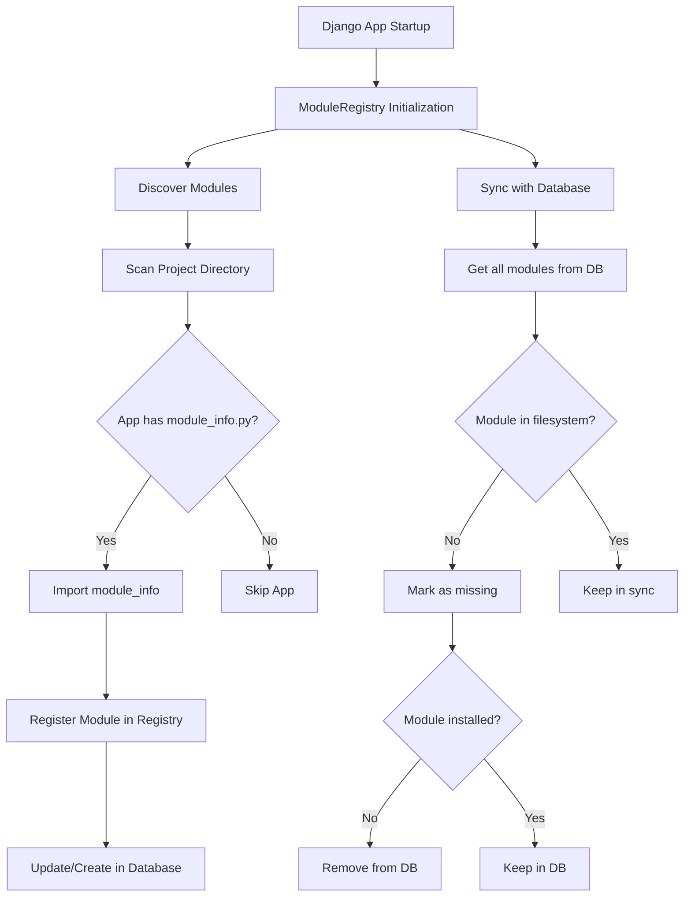
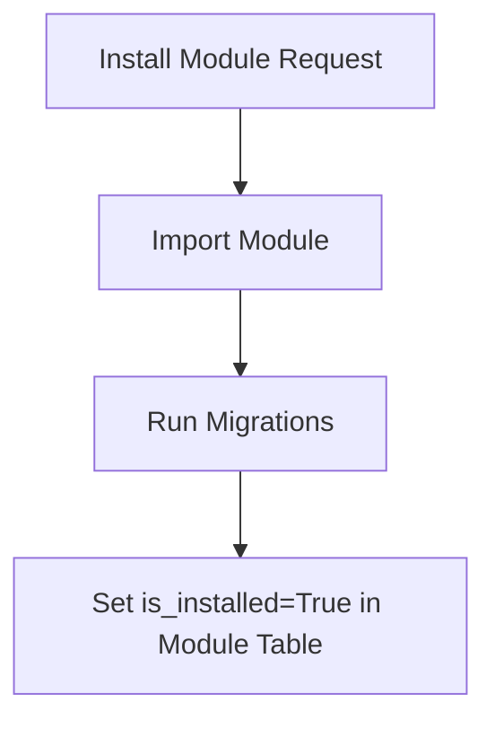
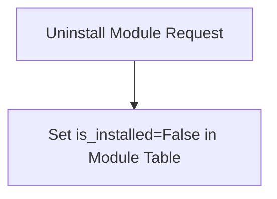
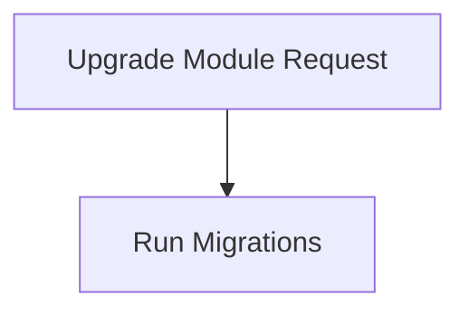
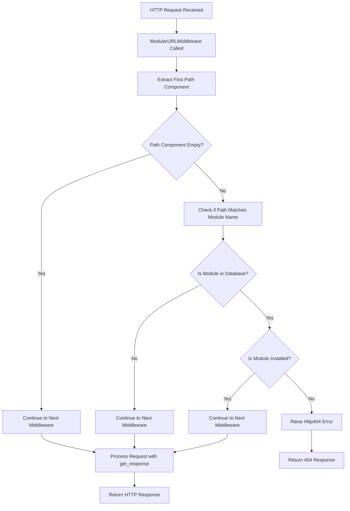
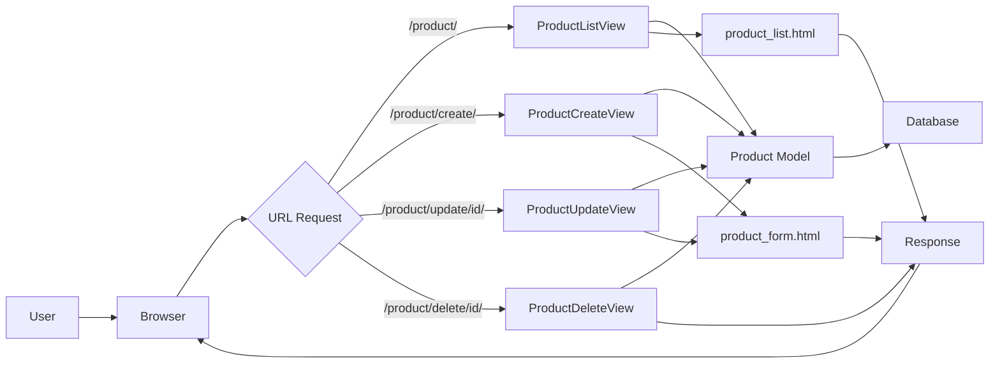
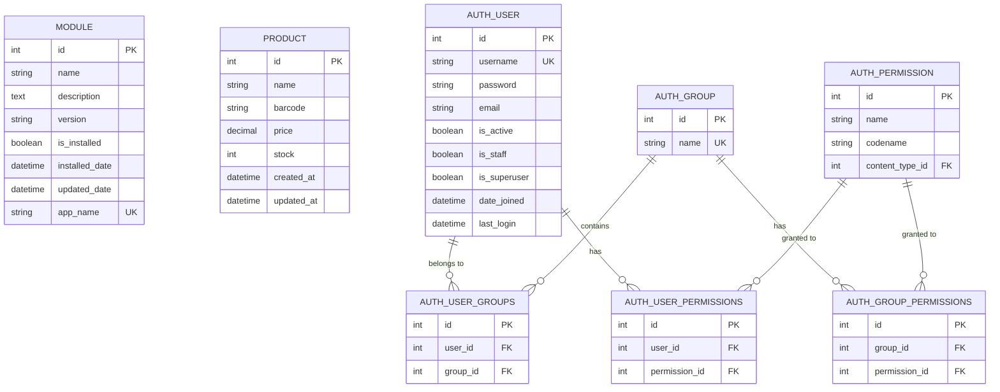

Date: 18 April 2025
Author: Fajar Agustian

# ERP
This Project is a simple ERP system that is built with Django and Python.

`yoursite.com/module` is page to manage modules.
`yoursite.com/product` is page to manage products.


## Modular Engine
This is the core of the ERP system, it is responsible for discovering and loading other modules or app.
### Module Registry/Discovery
This part explains how the module registry works and how it discovers modules.

When Django starts, the `ModuleRegistry` (in `module/registry.py`) class is initialized as a singleton instance. It performs two main functions:

1. **Module Discovery**: The registry scans the project directory looking specifically for Django apps that contain a `module_info.py` file. This file defines essential module metadata including:
   - `NAME`: The human-readable name of the module
   - `DESCRIPTION`: A detailed description of the module's functionality
   - `VERSION`: The current version number (defaults to '1.0.0' if not specified)

2. **Database Synchronization**: The registry maintains consistency between the filesystem and database by:
   - Updating existing entries when module metadata changes
   - Marking modules as "missing" if they exist in the database but not in the filesystem
   - Cleaning up database entries for uninstalled modules that no longer exist in the filesystem

This approach allows the ERP system to dynamically discover available modules without requiring manual registration, while maintaining a persistent record of module status in the database. The registry also provides methods to check if modules are installed, install modules, and manage dependencies.


### Module Installation

`is_installed` column is necessary to check if the module is installed or not, if not it will be not accessible and handle by the middleware.

### Module Uninstallation

it's clear

### Module Upgrade

The Upgrade means that the module is already installed, and we need to run the migrations again if there are any changes in database. it run function `call_command('migrate', module.app_name)`

### Module Middleware

The `ModularURLMiddleware` is a critical component that enables dynamic module activation and deactivation. It intercepts every HTTP request and controls access to module URLs based on their installation status.



#### How It Works

1. **Request Interception**
   - When an HTTP request arrives, Django passes it through the middleware chain
   - The `ModularURLMiddleware.__call__` method receives the request object

2. **Path Analysis**
   - The middleware extracts the first component of the URL path using:
     ```python
     path_parts = request.path.strip('/').split('/')
     if path_parts:
         path_prefix = path_parts[0]
     ```
   - For example, if the URL is `/product/list/`, it extracts `product` as the potential module name
   - If the path is empty (e.g., `/`), it skips the module check and continues processing

3. **Module Status Verification**
   - The middleware queries the database to check if the extracted path component matches an uninstalled module:
     ```python
     module = Module.objects.filter(app_name=path_prefix, is_installed=False).first()
     ```
   - This query is optimized to only return one result (using `.first()`) to minimize database load
   - It specifically looks for modules where:
     - `app_name` matches the path prefix
     - `is_installed` is set to `False`

4. **Access Control Decision**
   - If a matching uninstalled module is found, the middleware raises an `Http404` exception:
     ```python
     if module:
         raise Http404(f"Module '{path_prefix}' is not installed")
     ```
   - This prevents users from accessing features of modules that aren't currently installed
   - Django's exception handling middleware converts this to a proper 404 response
   - If no matching uninstalled module is found, the request continues through the middleware chain

5. **Request Continuation**
   - For all other requests (installed modules or non-module URLs), the middleware passes the request to the next handler:
     ```python
     response = self.get_response(request)
     return response
     ```
   - This ensures that installed modules function normally without performance impact

## Product Module

The Product module provides comprehensive inventory management capabilities, allowing users to create, view, update, and delete product information within the ERP system.

### Data Flow



### Implementation Details

#### Product Model

The Product model is the core data structure that represents product information:

The model includes:
- **name**: The product's display name
- **barcode**: A barcode for the product
- **price**: The product's price with decimal precision
- **stock**: The current inventory quantity
- **created_at/updated_at**: Timestamps for tracking changes

#### Views

The Product module implements class-based views with permission controls:

1. **ProductListView**: Displays all products with pagination
2. **ProductCreateView**: Handles product creation
3. **ProductUpdateView**: Manages product updates
4. **ProductDeleteView**: Handles product deletion

#### Permission System

The Product module integrates with Django's permission system to control access:

1. **View-level permissions**: Each view is decorated with appropriate permission requirements
2. **Template-level controls**: UI elements are conditionally displayed based on user permissions
3. **Redirect handling**: Unauthorized access attempts are redirected to the module list

```python
# Example of permission-based UI in template

    <a href="" class="btn btn-primary">Add Product</a>

```

#### Module Integration

The Product module integrates with the modular engine through:

1. **Module Registration**: The module defines its metadata in `module_info.py`
   ```python
   NAME = "Product Management"
   DESCRIPTION = "Manage products with name, barcode, price, and stock information."
   VERSION = "1.0.0"
   ```

2. **App Configuration**: The `apps.py` file connects to the module registry
   ```python
   def ready(self):
       """Register this module with the module registry"""
       from module.registry import registry
       # The registry automatically discovers and registers this module
   ```

3. **URL Namespace**: The module defines a namespace for its URLs
   ```python
   app_name = 'product'
   
   urlpatterns = [
       path('', ProductListView.as_view(), name='product_list'),
       # Other URL patterns...
   ]
   ```

## Entity Relationship Diagram

The following diagram illustrates the database structure of the ERP system, showing the relationships between core modules and their components:



The module and product components straight forward. The Product  does not have direct database relationships for permissions, as these are handled programmatically, The User and Auth component is default django auth.

